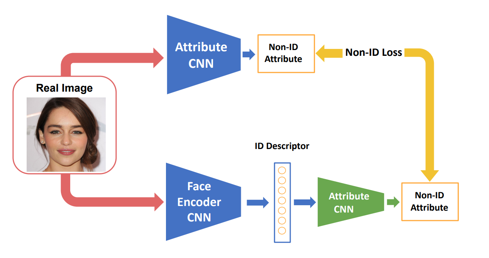
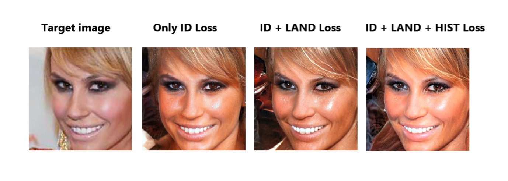

# ID2image: Leakage of non-ID information into face descriptors and inversion from descriptors to images
In this projecct, we present an optimisation strategy that uses a StyleGAN generative model to  recover images from an ID embedding.

## Requirments
- pytorch = 0.10.0
- Download the CelebA dataset from [https://mmlab.ie.cuhk.edu.hk/projects/CelebA.html](https://mmlab.ie.cuhk.edu.hk/projects/CelebA.html)


## Model Zoo
- The models are available for non-commercial research purposes only.  
- All models can be found in here.  
    - Rregressors for Non-ID attribute prediction of CelebA: [GDrive](https://drive.google.com/drive/folders/15bqQhs3_yiUYwkP8lp3vFz9fkHKHsLPU?usp=sharing) (the training code can be found in this repository)
    - Pretrained VGGface and VGGface2 model from [https://www.robots.ox.ac.uk/~albanie/pytorch-models.html](https://www.robots.ox.ac.uk/~albanie/pytorch-models.html)
    - Dlib 68-points Face landmark model from [http://dlib.net/files/shape_predictor_68_face_landmarks.dat.bz2](http://dlib.net/files/shape_predictor_68_face_landmarks.dat.bz2)

## Non-ID attribute prediction from ID
We begin by exploring to what extent we are able to esti-mate non-ID “attributes” from an ID descriptor provided by a pretrained face encoder CNN. We use “attribute” here in very general terms,  including image-based attributes suchas  landmark  positions  and  colour  histograms  and  non-ID 
face attributes such as the presence or absence of a smile,glasses or hat. 



For each attribute, we train an MLP that
maps from an ID descriptor to the target attribute. All the 
MLPs are trained on [CelebA](https://mmlab.ie.cuhk.edu.hk/projects/CelebA.html), We aligned
and cropped the original CelebA to a VGGFace2 compatible version and scaled all images to resolution 224. 

### Dataset Preprocessing 
The code for image alignment and cropping can be viewed in the [vggface2_style_crop](https://github.com/ml1652/ID2image/tree/main/vggface2_style_crop) folder.
- Cropping Examples
```console
python align.py --img_dir "./dataset" -save_dir "./cropped_dataset" --crop_size_h 224 --crop_size_w 224 --move_h 0.25 --move_w 0 --face_factor 0.8
```
The bounding box in crop code is extended by a factor of 0.8 starting from the center. And we move the center of the bounding box down by 0.25 to make the image look similar to the vggface2 dataset.

At the same time, because the position of the face landmark points after cropping is changeed, we use scripe [Generate_celebaLandmark.py](https://github.com/ml1652/ID2image/tree/main/vggface2_style_crop) to generate new landmarks poistion file. It should be noted that our cropping script will lose some images due to dlib recognition fails. We record the remaining images after cutting in this the imglist_after_crop.csv.

### Traninig Non_ID Regressors
In this project we trained several regressor including landmark  positions  and  colour  histograms  and  non-ID 
face attributes such as the smile, glasses or hat. The training script can be find in [training_code](https://github.com/ml1652/ID2image/tree/main/training_code) folder. Our trained model can be found [here](https://www.robots.ox.ac.uk/~albanie/pytorch-models.html).

## Image Reconstructed from ID with a generative model 

Take an face image you'd like to inversed. Then you align and crop the face image in an VGG Face style.
Then you can inversion this face image from a face descriptor by using the ID_encode_to_image.py script.
```bash
python ID_encode_to_image.py 
"test_image.jpg" 
--save_file_name inversion_result # The folder name use to save the result image and plot at.
--learning_rate 1 
--weight_landmarkloss 0.0006 
--vgg_to_hist 0.01 # weight of histogram loss
--iterations 2500  
```

### ID_encode_to_image.py
```
arguments:

  image_path            Filepath of the image to be inversed.
  
  --learning_rate       Learning rate for SGD.
                        
  --model_type          the model to use from InterFaceGAN repo.

  --iterations          Number of optimizations steps.
  
  --latent_type         type of StyleGAN latent vector (Z or WP), 
  
  --vggface_to_latent   Whether or not to use a vgg_to_latent model to intialise StyleGAN latent
  
  --vgg_to_hist         Whether or not to use histogram_loss during inversion
  
  --weight_landmarkloss the weighr of landmark_loss in loss fucntion
  
  --weight_histloss     the weighr of histogram_loss in loss fucntion
  
  --save_file_name      the folder used to save results
```

###### Example inversion result with original target image, reconstructions using only ID loss, ID + Landmark loss and full reconstruction loss.


